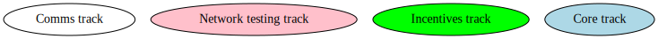
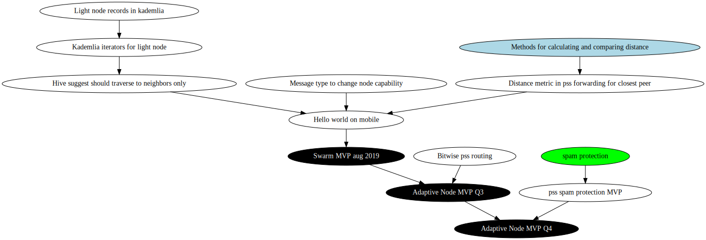
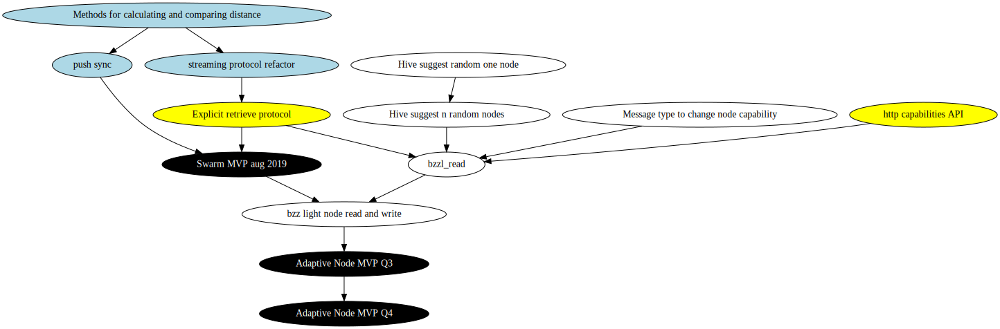
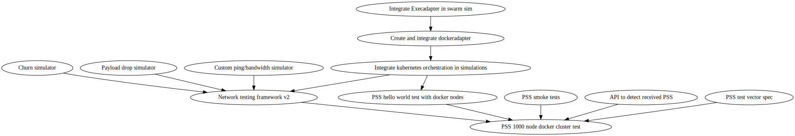
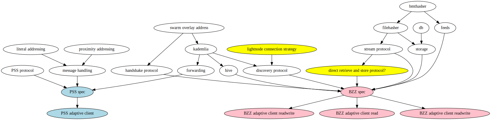

# SWARM ADAPTIVE NODES DEVELOPMENT TRACK

For epic describing this development track see [epic.md](./epic.md).

For an overview of user stories and various phases in this work, see [overview.md](./overview.md).

Draft of task scheduling can be found here [schedule.md](./schedule.md)

## DEPENDENCIES

**Legend**:

### PSS TRACK

**Status: Ready for review**

### BZZ TRACK

**Status: Ready for review**

### NETWORK TESTING

(Network testing is an external development track, this diagram shows how it fits into comms/adaptive nodes track)

**Status: Ready for review**

### SPECIFICATIONS

**Status: Draft**

## MEETINGS

- [bi-weekly](https://notes.status.im/swarm-adaptive-nodes?both)

### MINUTES

- [2019.06.10 - call Oskar/Louis](https://notes.status.im/oOJmxZgxQQ-KC_MjpVpokw#)

## READING

### CURRENT

- [Spec format example - status sunc protocol](https://github.com/status-im/bigbrother-specs/blob/mvds/data_sync/mvds.md)
- [Light node connection strategies](https://swarmresear.ch/t/light-client-connection-strategy/17)

### ARCHIVE

- [Initial Swarm issue](https://github.com/ethersphere/swarm/issues/458)
