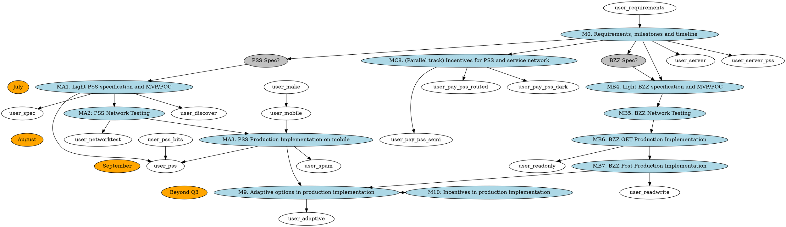

# Dependency graph

# Swarm Adaptive Nodes

Dependency graph.

Based on https://notes.status.im/swarm-adaptive-nodes# https://notes.status.im/oOJmxZgxQQ-KC_MjpVpokw# and https://github.com/nolash/swarm-adaptive-node

This should be **much clearer** for us to know what's realistic to achieve when.

Live version with graphviz rendering: https://notes.status.im/4CZQ7NbZTsyHf_2LilyQ4A?both
