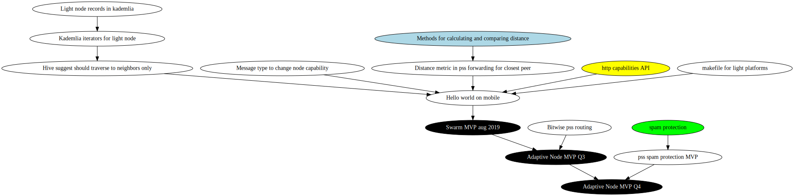
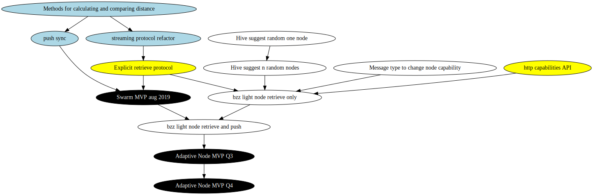
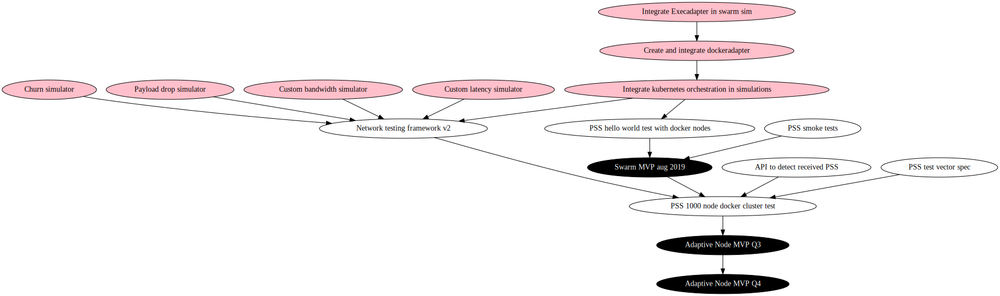

## Rationale ##

It should be possible to use Swarm on as many types of devices and configurations as possible.

## Owner ##

- Swarm: Louis Holbrook @nolash

## Stakeholder Point of Contact ##

- Status: Oskar Thorén @oskarth
- Felfele: Attila Gazso @agazso
- Mainframe: Paul Lecam @PaulLecam
- Datafund: Daniel Nickless @significance

## Dependencies ##

### PSS TRACK

### BZZ TRACK

### NETWORK TEST REQUISITES

### SPECIFICATIONS

### Optional ###

ENR integration
Migration from devp2p to libp2p

## Description ##

By resource-restricted we mean devices that have restrictions on one of more of:

- bandwidth
- network latency
- cpu
- memory
- storage

The node should be capable of any combination of three _modes of operation_:

- supporting PSS
- retrieving data from the network
- adding data to the network

## Context ##

Some devices and some scenarios come with restriced resources. Simulatenously these devices and scenarios may represent the bulk for end-users for applications building on Swarm. It must be possible to run Swarm with the bare necessities for the application's purpose.

Adaptive and "light" node implementations are strongly in demand by several parties currently working on Swarm integration. 

## Issues ##

## Acceptance criteria ##

Need to define:

- Resource usage benchmarks and limits
	* cpu
	* mem
	* bandwidth
	* storage caches

## Proof ##

1. Swarm MVP network tests

1. PSS delivery verification tests using 1000 docker nodes on kubernetes cluster with high message traffic load.

1. Cluster network running `n` full nodes and `m` light nodes over `t` period of time, where `m` light nodes iterate over the following test steps in sequence:
	* add new data 
	* access data known to exist (added in a)
	* can reach each other with pss messages

